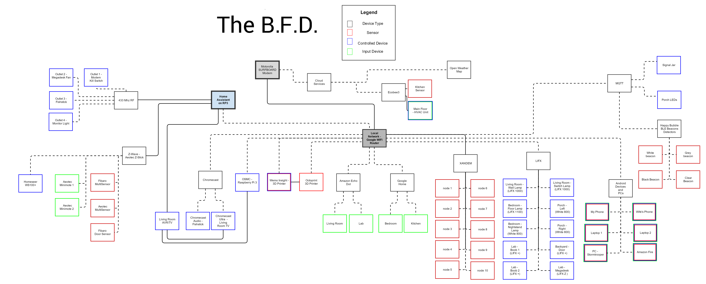

These are the Home Assistant configuration files used in the BRUH3 Home Automation project. Check out the [YouTube Series](https://www.youtube.com/playlist?list=PLgtGAtCt_hGTc_GAEmMhQ_XVs80mZoBIG) if you want to learn more about it! 

# Installation Process
I'm currently running [Home Assistant](https://home-assistant.io) version __0.46.0__. My preferred installation method is [Hassbian](https://github.com/home-assistant/pi-gen/releases).

After downloading the disk image and writing it to an SD card with [Etcher](https://etcher.io/), I run the following commands in [Putty](https://www.chiark.greenend.org.uk/~sgtatham/putty/latest.html) to install the required prerequisites. 

```
sudo hassbian-config install mosquitto
sudo hassbian-config install libcec
sudo hassbian-config install openzwave
sudo hassbian-config install samba
```
I also use [HASSCTL](https://github.com/dale3h/hassctl) which allows for some of thsee super simple commandline shortcuts for starting, stoping, upgrading, and debugging HA. 

```
hassctl update-hass
hassctl start
hassctl stop
hassctl error
```

# Hardware Running HA
* __[Raspberry Pi 3](http://geni.us/raspberrypi3)__
* __[Case](http://geni.us/2rQEgy5)__
* __[CanaKit 2.5A 5V Power Supply](http://geni.us/2ABPd1D)__
* __[Samsung Evo+ 64GB SD](http://geni.us/PbZS2oD)__
* __[Aeotec ZStick](http://geni.us/N2ULv)__
* __[433 RF RX TX](http://amzn.to/2b5wOS1)__

# Connected Devices

## 3D Printers
* __[Hictop Prusa I3 Clone](http://geni.us/by2Su1)__ - [video](https://www.youtube.com/watch?v=PLRdMtZVQfQ)
* __[Monoprice Mini Select V2](http://geni.us/qHc5)__

## CAMERAS
* __[Arlo Pro Cameras](http://geni.us/R6KFBLt)__ 
* __[Octoprint Camera](http://geni.us/L9zmAA)__
* __[Wansview Generic](http://geni.us/rUXCpE)__
* __[Annke Camera](http://geni.us/pIzE)__
* __[Starcam Camera](http://geni.us/FiF0)__

## Cloud Controlled Devices
* __[Amazon Echo Dot](http://geni.us/8dUBWY)__ - [video](https://www.youtube.com/watch?v=i0uLVU4wnSg)
* __[Google Home](https://madeby.google.com/home/)__ - [video](https://www.youtube.com/watch?v=jznH57NVEgM)
* __[Chromecast Ultra](https://www.google.com/chromecast/tv/ultra/?utm_source=made_by_google&utm_campaign=chromecast_ultra&utm_medium=MS)__
* __[Ecobee 3](http://geni.us/Rwah6)__ - [video](https://www.youtube.com/watch?v=CEKISVYLWbY)
* __[Echobee 4](http://geni.us/f2gP)__ - [video](https://www.youtube.com/watch?v=CEKISVYLWbY)

## DIY Projects
* __[RGB LED Strip Light](https://github.com/bruhautomation/ESP-MQTT-JSON-Digital-LEDs)__ - [demo](https://www.youtube.com/watch?v=DQZ4x6Z3678), [tutorial](https://www.youtube.com/watch?v=9KI36GTgwuQ)
* __[Neopixel Ring Light](https://github.com/bruhautomation/ESP-MQTT-JSON-Digital-LEDs)__ - makes a cool nightlight
* __[Multisensor](https://github.com/bruhautomation/ESP-MQTT-JSON-Multisensor)__ - [tutorial](https://www.youtube.com/watch?v=jpjfVc-9IrQ) It detects temperature, humidity, motion, light, and has a RGB Led.
* __[Smart Blinds V1](http://www.bruhautomation.com/single-post/2016/07/25/The-Cheapest-DIY-WIFI-Automated-Blinds)__ - [tutorial](https://www.youtube.com/watch?v=8bcYB-0bctE)
* __[RF Smart Outlets](http://www.bruhautomation.com/single-post/2016/07/22/433-MHz-RF-Outlets-Version-3)__ - [tutorial](https://www.youtube.com/watch?v=5UUazFbK-Hg)

## Local Network
* __[LIFX White 800](http://geni.us/cMhe)__
* __[LIFX Color 1000](http://geni.us/kPqhQ6)__
* __[LIFX](http://geni.us/kZtRv)__ - the new version of the color 1000
* __[LIFX +](http://geni.us/x9ASfx)__
* __[LIFX Z-Strip](http://geni.us/QQxfJ)__ - [video](https://www.youtube.com/watch?v=jKj2uPEsSlw)
* __[XANDEM Home](http://xandem.com/xandem-home)__ - [video](https://www.youtube.com/watch?v=pXOEu4Pfh0Y)
* __[Happy Bubble BLE Detector](http://geni.us/S4PMXAv)__ - [video](https://www.youtube.com/watch?v=oBkahrDfUFE)
* __[Amazon Dash](http://geni.us/hFfDYuu)__ - [video](https://www.youtube.com/watch?v=qZpJ9W0wCks)
* __[Sense Powerline Monitor](https://sense.com/buy.html)__
* __[Sonoff Outlets](http://geni.us/Svsd)__ - [video](https://www.youtube.com/watch?v=-JxPWA-qxAk)
* __[Google WIFI Mesh Routers](http://geni.us/6BkbVI)__
* __[Netgear Orbi Mesh Router](http://geni.us/HKA1r)__

## ZWave
* __[Fibaro Multisensor](http://geni.us/jZlRt)__
* __[Aeotec Minimotes]( http://geni.us/CcT9zw7)__ - [video](https://www.youtube.com/watch?v=5Vc1Ift7ND8)
* __[Aeotec Multisensor](http://geni.us/5RdjJyA)__
* __[Fibaro Door/Window Sensor](http://geni.us/32voqoV)__
* __[Go Control PIR](http://geni.us/vAcKK)__
* __[Go Control Door Sensors](http://geni.us/vAcKK)__
* __[GE Zwave Dimmer](http://geni.us/3udaM)__
* __[GE 3-Way Remote](http://geni.us/AVBw1tC)__
* __[GE Fan Controller](http://geni.us/R8dl)__
* __[Leviton Zwave Dimmer](http://geni.us/EZEwt2)__
* __[Leviton 3-Way Remote](http://geni.us/EsFez)__
* __[Home Seer HS-WD100+ Dimmer](http://geni.us/BVfIa)__
* __[Home Seer HS-WS100+](http://geni.us/mOEA)__


# BRUH3 Flow Diagram 

